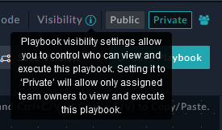
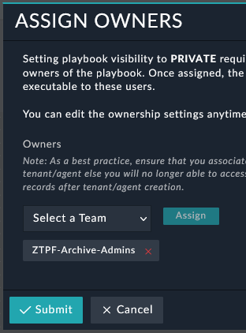

| [Home](../../../README.md) / [Setup](../README.md) |
|----------------------------------------------------|

# Setup ZTP Archives

Setting up the ZTP Archive consists of a few system level options and steps. Here are some components related to `ZTP Archives` for your system. 

 - Archive Roles
   - `ZTPF-Archive-User` - Can only see Archive Records.
   - `ZTPF-Archive-Admin` - Has full access to Archive Records but should not need to edit these directly. 
 - Archive Executions (playbooks) 
   - `10 - SP - FortiManager ZTP Flow - FortiManager(FMG)-Archives` - Collection of Archive Playbooks. 
     - `Subroutine` Tagged playbooks should be `Active` by default. 
     - `Button` Tagged playbooks are `Deactive` by default and should be `Activated` for use. You can also change these to `Private` and owned by the Team `ZTPF-Archive-Admins`, or any Team you want, to limit execution options to those that need access. 
 - Archive Teams
   - `ZTPF-Archive-Users` - If used to limit executions options. May only need access to backup selected records but not entire modules. 
   - `ZTPF-Archive-Admins` - If used to limit executions options. MAy need access to backup single or multiple records. Also would need access to restore records. 

## Step1 - Just Enable the Solution

To get the `ZTP Archives` kicked off perform the following steps. 

 A. In FortiSOAR `System Settings` and `Users`, add the role `ZTPF-Archive-User` and `ZTPF-Archive-Admins` to respective users. 

 B. In the Playbook collection `10 - SP - FortiManager ZTP Flow - FortiManager(FMG)-Archives` select all the button playbooks and `Activate`. 

## Step2 - Limit Executions (optional)

If you want to enable granular access to execution buttons in FortiSOAR you need to setup Teams and grant those Teams with ownership of the playbooks you want them to have access. 

  A. Follow the steps in the [Setup ZTPF Teams](../ztpf-teams/README.md) to create teams in FortiSOAR. 

  B. In FortiSOAR, go to the Playbook Collection `10 - SP - FortiManager ZTP Flow - FortiManager(FMG)-Archives` and make Playbook buttons you wish to change to Private and Add the Team that should have access. 
| Playbook Visibility | Playbook Owners | 
|---------------------|-----------------|
|  |  |