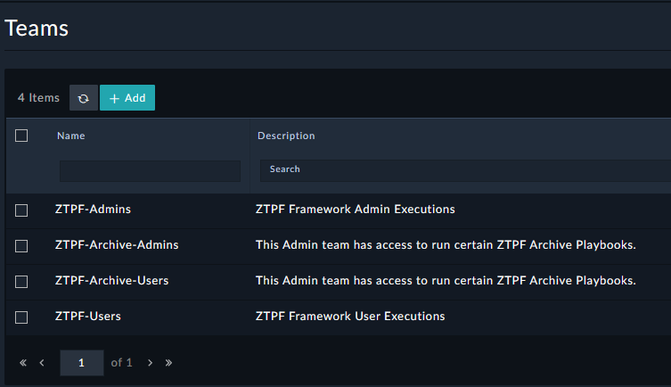

| [Home](../../../README.md) / [Setup](../README.md) |
|----------------------------------------------------|

# Setup ZTPF Teams

In FortiSOAR Teams can be leveraged to give granular access to objects that have ownership assignments. To create suggested Teams for ZTPF in FortiSOAR go to `System Settings`, `Import Wizard` and import the downloaded [FortiSOAR-Import-ZTPF-Teams.zip](./FortiSOAR-Import-ZTPF-Teams.zip) file. 

An example of using Teams can be found in the [Setup ZTP Archive](../ztp-archive/README.md).